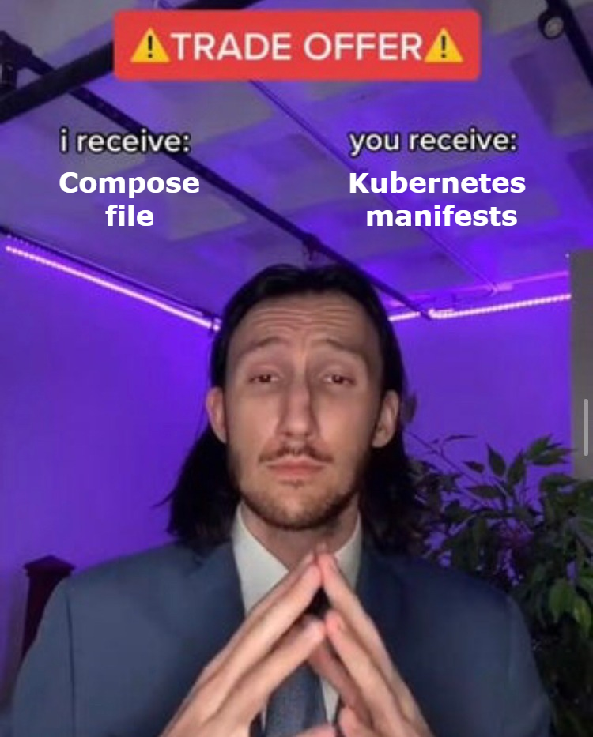
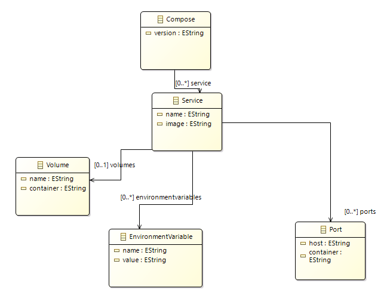
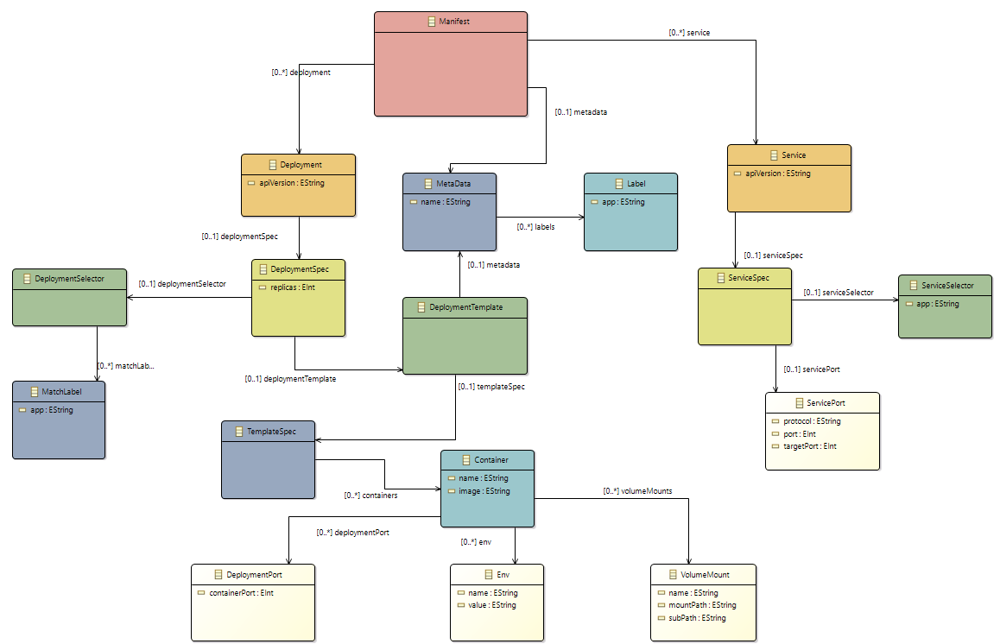

# Compose2Kubernetes

## Description
Compose2Kubernetes is a tool that converts a docker-compose.yml file into ready-to-use Kubernetes manifests.

### Backend
The project is build using Epsilon, a Model Driven Engineering framework that allows us to generate code from meta-models. 
Two meta-models are used in this project, the first one (source meta-model) is a UML class diagram that describes the structure of the docker-compose.yml file. The second one (target meta-model) is a UML class diagram that describes the structure of the Kubernetes manifests. Epsilon's Transformation Language (ETL) is used to define the transformation rules of the transformation from the source (compose) and the target meta-model (kubernetes).
After the transformation is successful, Epislon's Code Generation (EGL) is used to generate kubernetes manifest files from the transformed kubernetes meta-model.

For more information about Epsilon, please visit https://www.eclipse.org/epsilon/


#### Compose Meta-model v1


#### Kubernetes Meta-model v1



The project is still in its early stages, so the supported elements of Docker Compose file are limited to the following:
- Service
- Volume
- Environment variables
- Ports

As for the Kubernetes manifests, the generated manifests are limited to the following:
- Deployment
- Service

Each compose service is matched with a kubernetes deployment and a kubernetes service. The transformation rules are defined in the compose2kubernetes.etl file.


### Discord Bot
For the purpose of demonstration, we have created a discord bot that allows users to convert their docker-compose file to Kubernetes manifests by interacting with the bot. 

The bot is built using discord.js, a nodejs library that allows us to interact with the discord API.


## Usage
1. Clone the repository

    $ ``` git clone https://github.com/Douida-Othmane/Compose-To-Kubernetes.git  ```

2. Navigate to the repository
    
    $ ``` cd Compose-To-Kubernetes```
    
3. create .env file (see .env.example)
    
    $ ``` touch .env```

4. Run the docker-compose file

    $ ```docker-compose up```

5. Enjoy!

PS: You can optain the BOT_ID and BOT_TOKEN from the discord developer portal.

## Technologies
- NodeJS (discord.js)
- Spring Boot (Java)
- Epsilon (Model Driven Engineering)
- Docker

## Contributors
- Othmane Douida
- Salah Eddine Zemmouri
- Zin Eddine Lamziouik

## The project is open for collaboration, feel free to contribute with a PR!

